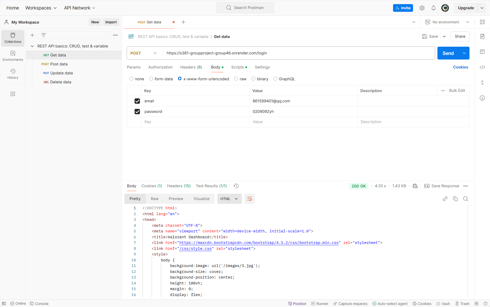
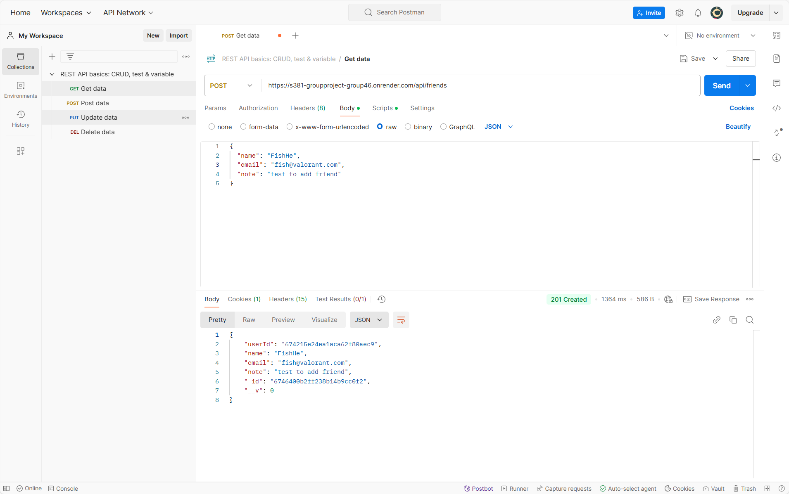
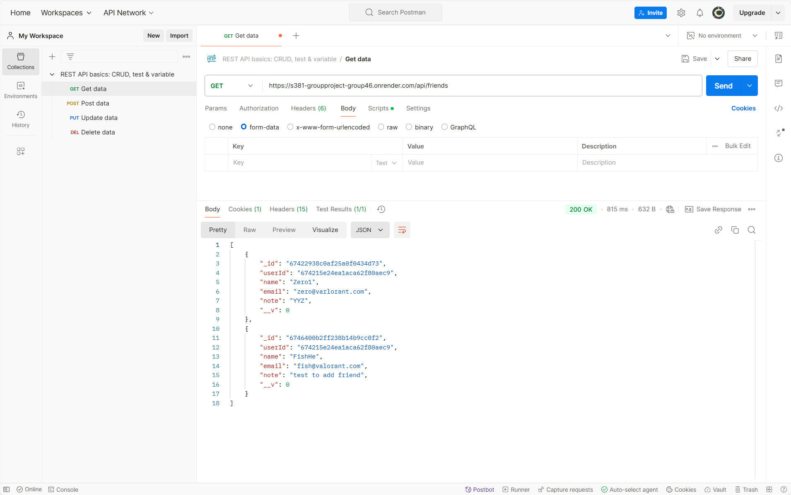
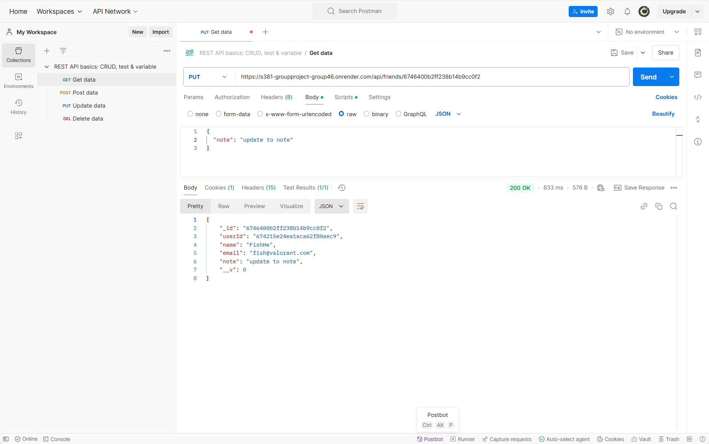
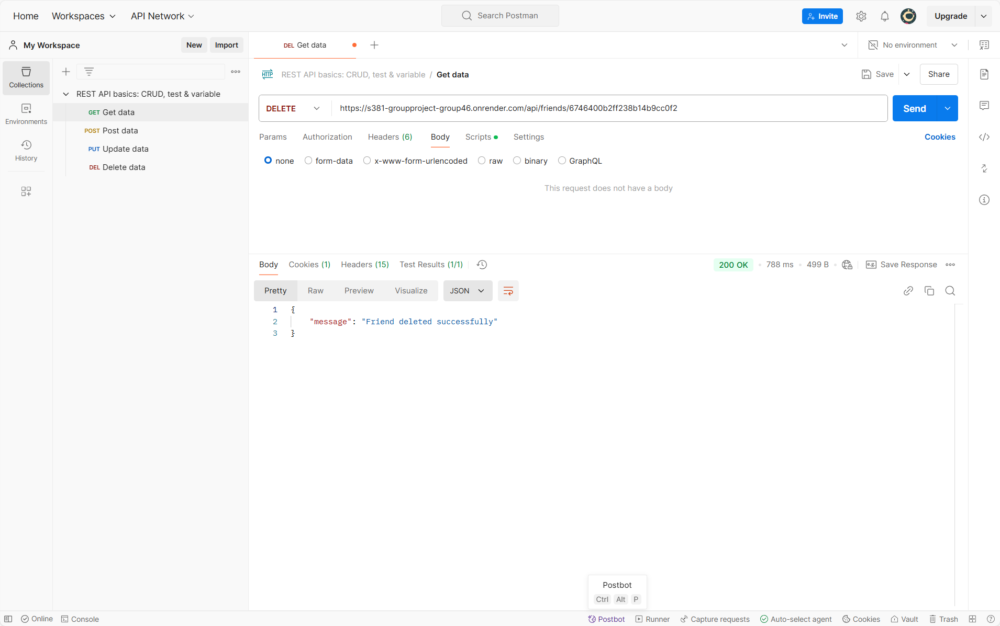

# S381_GroupProject_Group46
Deployment Link:https://s381-groupproject-group46.onrender.com

* Group members：  
Liu Qianli	(13265598)
Wang Zijian	(13277690)
Ye Yuzhang	(13156580)
Zhu Yanhong	(13271507)

## Project Overview:
This project is a full-stack web application based on Node.js and Express.js, designed to implement functionalities such as user registration, login, and friend management. It uses MongoDB Atlas as the database and renders front-end pages using the EJS template engine. Users can register, log in, manage friend lists, and update friend information through the system.

## Functional Overview:
- User registration and login: Users can create an account, log in and use related functions
- Friend management: add, update, delete friend information, and view friend list.
- RESTful API: Provides API interfaces for obtaining friend information, adding friends, updating friends, and deleting friends.
- User session: Manage user sessions through express-session to protect private pages.

## Use technology stack
- Backend framework: Express.js
- Database: MongoDB Atlas
- Front-end template engine: EJS
- User Authentication: bcrypt.js
- Session management: express-session
- Cross-Origin Resource Sharing: CORS

## Installation and operation	
### Prerequisites:
- Node.js (version 14 and above)
- Npm or Yarn package management tool
- MongoDB Atlas Database Account

### Installation Steps
- Clone this repository locally:
git clone https://github.com/Chuyuyuyu/S381_GroupProject_Group46.git 
- Go to the project folder:
cd S381_GroupProject_Group46
- Installation dependencies:
npm install
- Add the MongoDB Atlas database connection string:
MONGODB_URI=mongodb+srv://<username>:<password>@cluster0.mongodb.net/Project?retryWrites=true&w=majority 
SESSION_SECRET=your_secret_key 

### Deploy
The project has been deployed in the cloud using the Render platform. Through Render's automated deployment and hosting services, users can access the project directly online without having to configure it locally.

### Start a Project
Start the server using the following command:
npm start or node server.js

## Function Introduction:
### Register:
After the user submits the registration information, the server will perform the following processing:
- Check whether the email address has been registered to avoid duplicate registration.
- Encrypt user passwords with bcrypt to ensure security.
- Create and save a new user, storing their information in the MongoDB Atlas database.
- After successful registration, the user will be redirected to the login page.

If an error occurs during the registration process, such as the mailbox already exists or the database save fails, the system will display an error message to the user to inform the reason for the failure to register.

### Login:
- Search the database for user information based on the email address entered by the user. If the user cannot be found, a message "User does not exist" will be displayed.
- Use bcrypt to compare the password entered by the user with the encrypted password stored in the database to verify whether the password is correct. If the password is incorrect, it will prompt "Invalid credentials".

### Logout:
- Use the req.session.destroy() method to destroy the user's session information to clear the current user's login status.
- After the session is destroyed, the user is redirected to the login page.

## CRUD Service:
### Create - Create a friend
  Click the "Add Friend" button on the dashboard.ejs page.
The add friend form contains the following properties:
- Name (name): string
- Email (email): string
- Note (note): string – optional

When the form is submitted, the received data will be assigned to a new friend object, saved and redirected back to the dashboard.ejs page

### Read - Get the friends list
After logging in, the user can view the friends list on the dashboard.ejs page.
Clicking the "View All Friends" button will jump to the friends_list.ejs page, showing all the friends of the user.

### Update - Update friend information
Clicking the "Edit" button next to a friend in the friends_list.ejs page will jump to the edit_friend.ejs page.
After the update is successful, redirect back to the friends_list.ejs page.

### Delete - Delete a friend
In the friends_list.ejs page, there is a "Delete" button next to each friend.
After the deletion is successful, the page will redirect back to dashboard.ejs or friends_list.ejs.

## RESTful
In this project, there are four HTTP: post, get, update and delete.
### POST
#### Login
URL: http://localhost:3000/login
Headers: Content-Type: application/json
Body: x-www-form-urlencoded
	email: “Registered Email”
	password “Registered password”
	
 
#### Add friends
URL: http://localhost:3000/api/friends
Content-Type: application/json
Body: Raw and use JSON format.
{
  "name": "LQL",
  "email": "LQL@Valorant.com",
  "note": "G8L"
}
 

### Get
#### Get friends list
URL: http://localhost:3000/api/friends
Headers: Cookie.
 

### Put:
#### Update friend information
URL: http://localhost:3000/api/friends/:friendId (friendId needs to be replaced with the 24-digit ObjectID of the friend you want to update.)
Headers: Content-Type: application/json
Body: Raw and use JSON format.
{
  "name": "LQL",
  "email": "LQL@Valorant.com",
  "note": "Update to G8L"
}
 

### Delete
#### Deleting a friend
  URL: http://localhost:3000/api/friends/:friendId (friendId needs to be replaced with the 24-digit ObjectID of the friend you want to update.)
 

              

